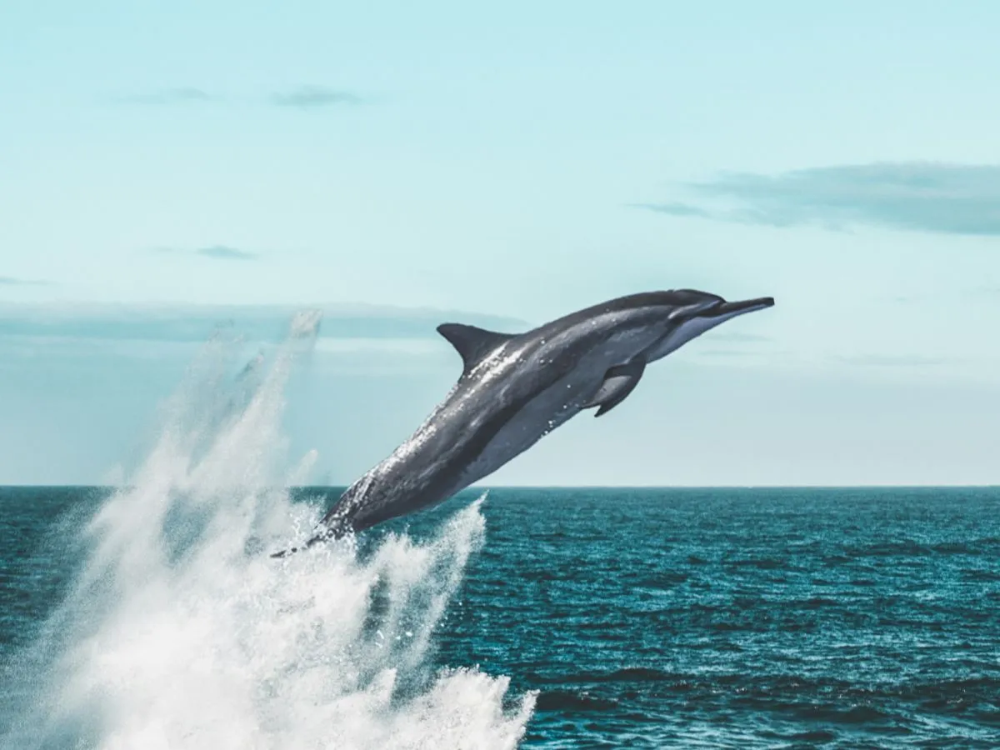

Welcome to the captivating world of dolphins, the playful creatures of the ocean! Prepare to embark on an exciting journey into the enchanting lives of these remarkable marine mammals. Dolphins aren't just sleek swimmers; they're the charismatic rulers of the underwater realm, captivating all who encounter them.

### Pod Power

In the vast expanse of the ocean, dolphins form tight-knit groups known as pods, much like families. Within these pods, there's a strong sense of camaraderie, with each member looking out for one another. Dolphins are social mammals that swim together, protect each other, and hunt for food as a team. 

Communication is key in the underwater world of dolphins. They use a complex system of clicks, whistles, and body language to communicate with one another, forming close bonds and coordinating their movements during hunts and play.

### Underwater challenges

Life in the ocean is full of adventures and challenges for dolphins. From hunting for fish to navigating through vast ocean currents, they must rely on their keen senses and intelligence to thrive in their watery world. However, human activity poses significant threats to their survival, including habitat loss, ocean pollution, and entanglement in fishing gear.

Understanding the importance of dolphins in their marine ecosystem is crucial, as they play a vital role in maintaining the balance of oceanic ecosystems, controlling fish and squid populations, and contributing to the health of coral reefs.

### Did You Know?

Dolphins are fascinating creatures with many unique traits and behaviors. Here are some interesting facts about these intelligent marine mammals:
- Dolphins are highly intelligent animals, known for their self-awareness, problem-solving, and empathy.
- They are known for their playful nature, often seen riding waves, leaping out of the water, and engaging in acrobatic displays.
- There are nearly 40 species of marine dolphins - living all around the world in both saltwater and freshwater environments.