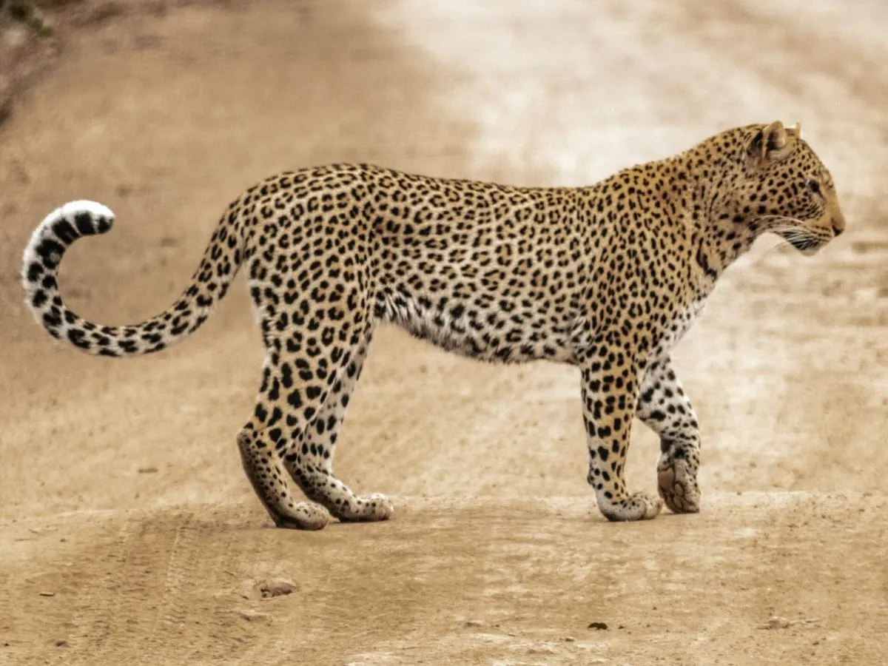

Welcome to the enchanting realm of leopards, the elusive phantoms of the African wilderness! Prepare to embark on a journey through the mesmerizing world of these stealthy felines. Leopards, with their sleek coats and piercing eyes, are the epitome of stealth and agility in the animal kingdom, navigating the dense forests and rugged landscapes with unparalleled grace and finesse. But there's more to these solitary hunters than meets the eye. Beyond their solitary nature lies a tale of resilience and adaptation.

### The Solitary Stalkers

In the heart of the African wilderness, leopards lead solitary lives, prowling through the shadows of the night with silent determination. Unlike lions, they are solitary creatures, preferring the solitude of their own company as they navigate the dense undergrowth in search of prey. Their solitary lifestyle doesn't make them any less formidable; in fact, it's a testament to their remarkable hunting prowess. With unparalleled agility and stealth, leopards are expert ambush predators, capable of taking down prey much larger than themselves.

Life in the wilderness is fraught with challenges for leopards. Habitat loss, poaching, and conflicts with humans pose significant threats to their survival. Yet, these elusive cats continue to adapt, finding refuge in the most remote corners of their shrinking territories. Conservation efforts are crucial to safeguarding their future, ensuring the survival of future generations.

So, the story of the leopard is not just a tale of solitary hunters roaming the African wilderness—it's a testament to the resilience of nature, the importance of conservation, and the strong spirit of these felines.

### Did You Know?

Leopards are fascinating creatures with many unique traits and behaviors. Here are some interesting facts about these elusive predators:

- Leopards have a distinctive rosette pattern on their fur, which provides excellent camouflage in their natural habitat, allowing them to blend seamlessly into their surroundings for stealthy ambushes.
- Leopards are very fast felines and can run at speeds of up to 58 km/h! They can also leap up to 6 meters forward through the air, showcasing their incredible agility.
- They are incredibly strong climbers and often hoist their kills into the branches of trees to keep them safe from scavengers and other predators.
