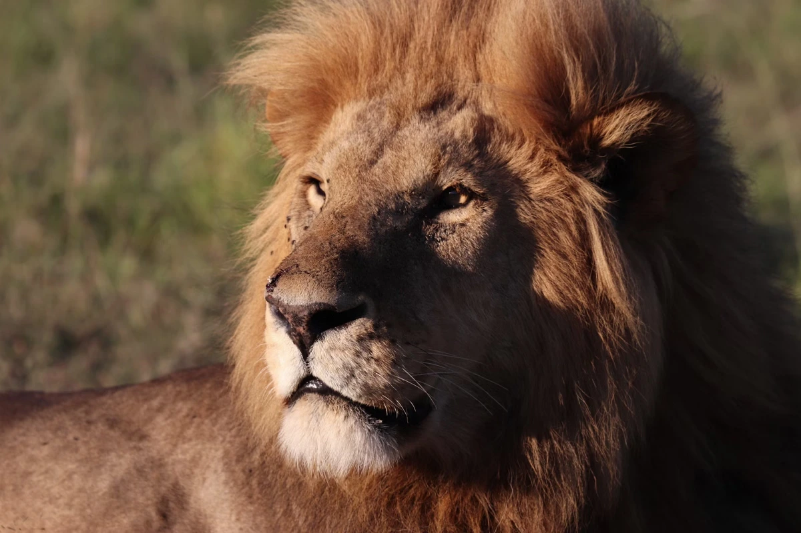

Welcome to the thrilling realm of lions, the majestic rulers of the African savanna! Get ready to dive deep into the captivating world of these magnificent creatures. Lions aren't just big cats; they're like royalty, ruling over the vast grasslands with grace and power. You may have heard them called the "king of beasts,
" and rightfully so! But there's more to these regal animals than meets the eye. Behind their royal appearance lies an incredible story of survival and community.

### Pride and Power

In the wild, lions live in tight-knit groups called prides, each with its own unique dynamics. Within these prides, there's a hierarchy where everyone has a role to play to contribute to the pride's success. Females are the primary hunters, relying on teamwork to track down prey, while the males serve as the guardians of the territory.

Life in the savannah is not without its challenges. Due to human activity lions face threats to their survival. Habitat loss and conflicts with humans have led to a decline in their populations, prompting conservation efforts to protect these magnificent creatures. Understanding the importance of lions in their ecosystem is crucial as they play a vital role in maintaining the balance of the ecosystem, controlling the populations of herbivores and ensuring the health of the environment.

So, the story of the lion is not just a tale of majestic beasts roaming the savannah—it's a lesson in the delicate balance of nature, the importance of conservation, and the beauty of the wild.

### Did You Know?

Lions are fascinating creatures with many unique traits and behaviors. Here are some interesting facts about these majestic big cats:

- There are only two lion subspecies in the wild: the African lion (Panthera leo leo) and the Asiatic lion (Panthera leo persica).
The African lion is found in Africa, south of the Sahara desert, while the Asiatic lion (Panthera leo persica) exists in western India.
- Lions are the only known cat species where individuals roar together. Their roars can be heard from miles away, serving as a form of communication to establish territory and coordinate within the pride.
- Lions are the most sociable of the big cats, living in prides that can be as large as 40 members.
